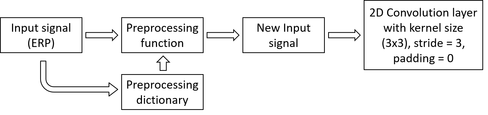

# Saliency prediction for 360-degree video
### Introduction
This repo contains the codes that are used in the paper **Saliency prediction for 360-degree video** which is also a part of the Capstone project of student: **Vo Hoang Chuong** from **the University of Science and Technology - The University of Danang**.

### Saliency prediction for 360-degree video
In this work, we proposed a novel spherical convolutional network concentrating on 360° video saliency prediction in which the kernel is defined as a spherical cap. In the process of convolution, instead of using neighboring pixels with regular relationship in the equirectangular projection coordinate, the convolutional patches will be changed to preserve the spherical perspective of the spherical signal. The proposed spherical convolutional network is evaluated by Pearson correlation coefficient (CC) and Kullback–Leibler divergence (KLD). Our experiments show the efficiency of our pro-posed spherical convolution method’s application in 360° video saliency detection utilizing spherical U-net model.

In this case, we choose the kernel used in convolutional layer is 3x3 kernel. In the convolution process, the kernel will be elementwised multiplied with each 3x3 patch of the image. Our intention is to change the values in each 3x3 patch so that the perspective of the spherical image can be preserved during the convolution.
|  |
|:---:|
| *Spherical convolution framework* |

**Preprocessing function:** For a conventional picture with resolution (240x480), we firstly take out 240x480 = 1,152,000 pixels and put them as the center pixel of 1,152,000 (3x3) patches. After that, we replace all the surrounding pixels of these patches with the corresponding surrounding pixels according to their coordinate in spherical domain. Next, we put these patches together in order to form a new image with resolution: 720x1440.
|  |
|:---:|
| *Framework of the preprocessing function* |

For an example 3x3 patch from the image The central coordinate is: (0,0). By searching the (0,0) coordinate in the dictionary file, we acknowledge that the corresponding surrounding coordinates are: 
The patch’s surrounding pixels will be replaced by the pixels with the other pixels on the image having the surrounding coordinates in the matrix obtained above. 
|  |
|:---:|
| *The process of replacing the surrounding pixels in the 3x3 patch* |
After changing each of the patches in the image, we can put them together to create a new image with each size is 3 times larger than the original one. The new image will become the input of the next convolutional layer.

The model utilized for saliency map inference in this work is Spherical U-net model.
|  |
|:---:|
| *Spherical U-net model* |

### Configuration
  - Python 3.6 is required.
  - Module Used in this project:
    + pytorch: 1.5.0
    + CUDA toolkit: 10.2
    + CuDnn: 7.6.5
    + Numpy: 1.17.4
    + torchvision: 0.6.0
    + Pillow: 7.0.0
    + visdom: 0.1.8.9
    
### How to use
**Testing:** In order to reproduce the results of the project, you just need to simply run `Testing_model.py`. The Groundtruths, frames, saliency maps will be saved respectively in an auto-generated result folder. We used the visdom lib to visualize the output of the model. Before running the code, please initiate visdom by typing `visdom` in `cmd`(Windows) or `Terminal prompt`(Ubuntu). Then, go to `http://localhost:8097/`, choose env `test1` to watch the visualization. For in depth usage, please refer to the official git of [visdom](https://github.com/facebookresearch/visdom) to know how to use it. (The code will still run normally if you disable visdom related lines).

**Training:** In order to retrain the model from scratch, you just need to simply run `train.py`. Feel free to change the training parameters if you would like to improve the results. We also use visdom to visualize the process of training. Please follow te steps as mentioned above and choose env `final` to watch the visualization.

### Dataset
The Dataset we used is taken from paper *Saliency Detection in 360° Videos* by **Ziheng Zhang, Yanyu Xu**, Jingyi Yu and Shenghua Gao.
The original download link is in [[Baidu Pan]](https://pan.baidu.com/share/init?surl=akj0-8obIwC9oykTYSUm9Q) the passcode is *ry6u*.
However, since you need to install Baidu NetDisk to download the folder and Baidu requires premium account for full speed downloading, it takes a lot of time to download the Dataset.
I have reuploaded it in [[Onedrive]](https://bit.ly/Sal_dataset_2018_ECCV), password: **Saliency2018** for more convenient access.
There are 12 zip files, and train/test index. After downloading these zips, unzip them together. Then, put the unzipped folders and the file 'vinfo.pkl' into the same folder named '360_Saliency_dataset_2018ECCV'

### Result
|  |
|:---:|
| *Results* |

### Inspiration
This code is inspired by the work of [Ziheng Zhang, Yanyu Xu](https://github.com/xuyanyu-shh/Saliency-detection-in-360-video).

### Acknowledgement
I would like to express my gratitude towards **[Assoc. Prof. Jui-Chiu Chiang](https://ieeexplore.ieee.org/author/37416120400)** for her guildance and supersivison. I also want to give special thanks to **[Mr. Ziheng Zhang](https://scholar.google.com/citations?user=QQ2-OOUAAAAJ&hl=en)** for helping me in understanding the workflow of his spherical CNN. Extremely thanks to the Pytorch community for the valued information. 

### TO DO
  - [x] Reupload the Dataset to a more accessible platform
  - [x] Release supporting files and functions
  - [x] Release training code
  - [x] Release weight file and testing code
  - [ ] Release the code for generating the coordinates of the surrounding pixels corresponding to each center pixel in panorama format
  - [ ] Implement generic custom spherical convolution for any input size 
  
### License
This project is released under the MIT License.
